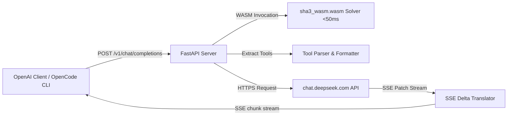

# DeepSeek OpenAI-Compatible API Wrapper

A high-performance, pure HTTP/SSE OpenAI-compatible API bridge for the DeepSeek Web interface. Operates directly over standard HTTP/2 and Server-Sent Events (SSE) without running any background browser instances during API operations.

> [!WARNING]
> ### ⚠️ Disclaimer & Terms of Use
> - **Not Affiliated with DeepSeek:** This is an independent, community-driven project and is **not an official API**. It is **not affiliated with, endorsed by, maintained by, or in any way officially connected with DeepSeek** (Hangzhou DeepSeek Artificial Intelligence Co., Ltd.).
> - **Educational & Research Purposes Only:** This software is provided strictly for educational, experimental, and personal research purposes to study reverse-engineering, proof-of-work protocols, and API translation.
> - **Do Not Abuse Free Services:** Do **not** use this project to spam, launch denial-of-service attacks, conduct mass automated scraping, or abuse the free web services graciously provided by DeepSeek. Respect service quotas and server infrastructure.
> - **Account Risk & Suspension Notice:** Accessing web interfaces through automated or programmatic wrappers may violate DeepSeek's Terms of Service and could result in **temporary rate-limiting or permanent suspension of your DeepSeek account**. 
> - **Use a Secondary Account:** **Do not use your primary personal or business account.** Always use a secondary / test account so you do not risk losing access to your primary account or chat history. The authors and contributors assume no responsibility or liability for any account suspensions, bans, or data loss incurred through the use of this software.

---

## Features

- ⚡ **Pure HTTP/SSE Runtime:** No headless browser or Chromium instances running during API requests. Operates as a fast, lightweight asynchronous Python microservice.
- 🏎️ **<50ms WebAssembly PoW Solver:** Solves DeepSeek's `DeepSeekHashV1` Proof-of-Work challenge in under 50ms using the locally compiled WASM engine (`sha3_wasm.wasm`).
- 🛠️ **Native Tool & Function Calling:** Translates between OpenAI standard `tools` / `tool_calls` schemas and DeepSeek XML syntax. Built for agentic coding tools like **OpenCode CLI**, **Claude Code**, **Cursor**, and **LibreChat**.
- 🧠 **Deep Reasoning Support:** Streams chain-of-thought tokens in real-time under `delta.reasoning_content` (OpenAI / DeepSeek R1 standard).
- 📎 **Multimodal Image & Document Attachments:** Supports OCR text extraction on Flash models, full multimodal visual understanding on Vision models, and document parsing across 900+ file extensions.
- 🖥️ **Headless & Cloud-Ready:** Supports headless server deployments (VPS, Docker, SSH) with a 5-second console token extraction workflow.

---

## 1. Quick Start

### Prerequisites
- **Python 3.10+**
- **Node.js** (required to execute the local WASM Proof-of-Work solver)

### 1.1 Clone and Install
```bash
git clone https://github.com/Guri-ui/deepseek-oi-api.git
cd deepseek-oi-api

python3 -m venv .venv
source .venv/bin/activate
pip install -r requirements.txt
```

---

## 2. Authentication

You only need your DeepSeek account's **`userToken`**. Choose the method that best fits your environment:

### Method A: Headless Server / VPS (Fastest — 5 Seconds)

If running on a remote server or VPS, you **do not** need to clone the repo locally to log in. Obtain the token directly from your everyday desktop browser:

1. Open [chat.deepseek.com](https://chat.deepseek.com) in your regular browser (Chrome, Firefox, Safari, Edge) and log in with your secondary account.
2. Open Developer Tools (<kbd>F12</kbd> or <kbd>Ctrl</kbd>+<kbd>Shift</kbd>+<kbd>I</kbd> / <kbd>Cmd</kbd>+<kbd>Option</kbd>+<kbd>I</kbd>) and click the **Console** tab.
3. Paste this command and hit <kbd>Enter</kbd>:
   ```javascript
   copy(JSON.parse(localStorage.getItem("userToken")).value);
   ```
   *(This automatically copies your clean token to your clipboard!)*
4. On your headless server, set the environment variable:
   ```bash
   export DEEPSEEK_TOKEN="<PASTE_COPIED_TOKEN>"
   ```
   *(Or write it to `.env` / `deepseek_token.json`)*

---

### Method B: Local Desktop (Automated Browser Helper)

If you are running locally on a machine with a desktop display, you can use the built-in login helper:

```bash
python login.py
```
- Launches **Camoufox** anti-detect browser with local binaries in `./browsers`.
- Complete the login interactively (Email, SMS, Google, or Apple).
- The script automatically captures your session and saves `deepseek_token.json`.

---

## 3. Running the Server

Start the API wrapper:
```bash
python main.py
```

* **Base URL:** `http://localhost:8000/v1`
* **Health Check:** `http://localhost:8000/health`
* **Models Endpoint:** `http://localhost:8000/v1/models`

To customize the host and port:
```bash
HOST=0.0.0.0 PORT=8080 python main.py
```

---

## 4. Supported Models

The API routes requests to exactly 6 canonical models:

| Model ID | DeepSeek Mode | Reasoning (`thinking_enabled`) | Input Modalities | Best Use Case |
| :--- | :---: | :---: | :---: | :--- |
| **`deepseek-v4-flash`** | `default` | Disabled | Text, Docs, OCR Images | Fast general-purpose chat, code & document OCR |
| **`deepseek-v4-flash-thinking`** | `default` | **Enabled** | Text, Docs, OCR Images | Fast chain-of-thought reasoning with OCR |
| **`deepseek-v4-pro`** | `expert` | Disabled | Pure Text | Advanced multi-domain expert coding |
| **`deepseek-v4-pro-thinking`** | `expert` | **Enabled** | Pure Text | Deep reasoning with DeepThink (R1) |
| **`deepseek-v4-vision`** | `vision` | Disabled | Text, Images, Docs | Full multimodal vision & UI understanding |
| **`deepseek-v4-vision-thinking`** | `vision` | **Enabled** | Text, Images, Docs | Multimodal vision + DeepThink reasoning |

---

## 5. File & Attachment Support

| Category | Supported File Types | Supported Models | Limits |
| :--- | :--- | :---: | :---: |
| **🖼️ Images (Visual Understanding)** | `.png`, `.jpg`, `.jpeg`, `.webp`, `.gif`, `.heic`, `.svg`, `.bmp`, `.avif`, `.tif` | `vision`, `vision-thinking` | 100 MB / 50 files |
| **🔍 Images (OCR Text Extraction)** | `.png`, `.jpg`, `.jpeg`, `.webp`, `.gif`, `.bmp` (Receipts, code screenshots, scans) | `flash`, `flash-thinking`, `vision` | 100 MB / 50 files |
| **📄 Documents & Data** | `.pdf`, `.docx`, `.doc`, `.xlsx`, `.xls`, `.pptx`, `.ppt`, `.csv`, `.tsv`, `.txt`, `.md` | `flash`, `vision` (all variants) | 100 MB / 50 files |
| **💻 Code Files** | 900+ Extensions (`.py`, `.js`, `.ts`, `.cpp`, `.rs`, `.go`, `.java`, `.sh`, `.sql`, `.json`, `.yaml`) | `flash`, `vision` (all variants) | 100 MB / 50 files |
| **🚫 Pro Models** | *Text prompts only* (DeepSeek Expert mode does not accept attachments) | — | — |

---

## 6. Client Integrations

### 6.1 OpenCode CLI Configuration
Add the provider to `~/.config/opencode/opencode.json`:

```json
{
  "$schema": "https://opencode.ai/config.json",
  "provider": {
    "deepseek-local": {
      "npm": "@ai-sdk/openai-compatible",
      "name": "DeepSeek Local",
      "options": {
        "baseURL": "http://127.0.0.1:8000/v1",
        "apiKey": "EMPTY"
      },
      "models": {
        "deepseek-v4-pro": {
          "name": "DeepSeek V4 Pro",
          "tool_call": true,
          "limit": { "context": 131072, "output": 8192 }
        },
        "deepseek-v4-pro-thinking": {
          "name": "DeepSeek V4 Pro Thinking",
          "tool_call": true,
          "limit": { "context": 131072, "output": 8192 }
        },
        "deepseek-v4-flash": {
          "name": "DeepSeek V4 Flash",
          "tool_call": true,
          "limit": { "context": 131072, "output": 8192 }
        },
        "deepseek-v4-vision": {
          "name": "DeepSeek V4 Vision",
          "tool_call": true,
          "limit": { "context": 131072, "output": 8192 }
        }
      }
    }
  },
  "model": "deepseek-local/deepseek-v4-pro",
  "small_model": "deepseek-local/deepseek-v4-flash"
}
```

---

### 6.2 OpenAI Python SDK

```python
from openai import OpenAI

client = OpenAI(
    base_url="http://localhost:8000/v1",
    api_key="not-needed"
)

# Real-time streaming with reasoning trace
stream = client.chat.completions.create(
    model="deepseek-v4-pro-thinking",
    messages=[
        {"role": "user", "content": "Write a thread-safe LRU cache in Python."}
    ],
    stream=True
)

for chunk in stream:
    delta = chunk.choices[0].delta
    # Reasoning / Thinking trace
    if hasattr(delta, "reasoning_content") and delta.reasoning_content:
        print(f"\033[90m{delta.reasoning_content}\033[0m", end="", flush=True)
    # Output content
    if delta.content:
        print(delta.content, end="", flush=True)
```

---

### 6.3 Function / Tool Calling Example

```python
import json
from openai import OpenAI

client = OpenAI(base_url="http://localhost:8000/v1", api_key="EMPTY")

tools = [
    {
        "type": "function",
        "function": {
            "name": "get_weather",
            "description": "Get current weather for a city",
            "parameters": {
                "type": "object",
                "properties": {
                    "city": {"type": "string", "description": "City name"}
                },
                "required": ["city"]
            }
        }
    }
]

response = client.chat.completions.create(
    model="deepseek-v4-pro",
    messages=[{"role": "user", "content": "What is the weather in Tokyo?"}],
    tools=tools
)

message = response.choices[0].message
if message.tool_calls:
    for tool_call in message.tool_calls:
        print("Tool to invoke:", tool_call.function.name)
        print("Arguments:", json.loads(tool_call.function.arguments))
```

---

### 6.4 Image Upload / Vision Analysis

```python
import base64
from openai import OpenAI

client = OpenAI(base_url="http://localhost:8000/v1", api_key="EMPTY")

with open("screenshot.png", "rb") as f:
    b64_image = base64.b64encode(f.read()).decode("utf-8")

response = client.chat.completions.create(
    model="deepseek-v4-vision",
    messages=[
        {
            "role": "user",
            "content": [
                {"type": "text", "text": "Describe what is shown in this image:"},
                {
                    "type": "image_url",
                    "image_url": {"url": f"data:image/png;base64,{b64_image}"}
                }
            ]
        }
    ]
)

print(response.choices[0].message.content)
```

---

## 7. Architecture & Technical Details



1. **Proof-of-Work Engine:** When DeepSeek requests a challenge on `/api/v0/chat/create_pow_challenge`, the Python bridge calls `pow_solver.js` via Node.js, computing the SHA3 challenge hash in <50ms with zero CPU bottleneck.
2. **SSE Translation:** Converts DeepSeek's JSON-patch updates (`APPEND`, `BATCH`, `response/fragments/-1/content`) into OpenAI `chat.completion.chunk` Server-Sent Events in real-time.
3. **Safe Tool Interception:** XML tool invocations (`<tool_calls><invoke>...</invoke></tool_calls>`) emitted by DeepSeek are buffered and parsed on the fly. No raw XML tags leak into `delta.content`.
4. **Context & Token Capacity:**
   - **Attention Window:** 131,072 tokens (128K) for 100% accurate code recall.
   - **Max Output Generation:** 8,192 tokens (8K).
   - **Max HTTP Payload Ingestion:** Up to ~3.9 Million characters (~975,000 tokens) per session.

---

## License

This project is dedicated to the public domain under [The Unlicense](LICENSE).
